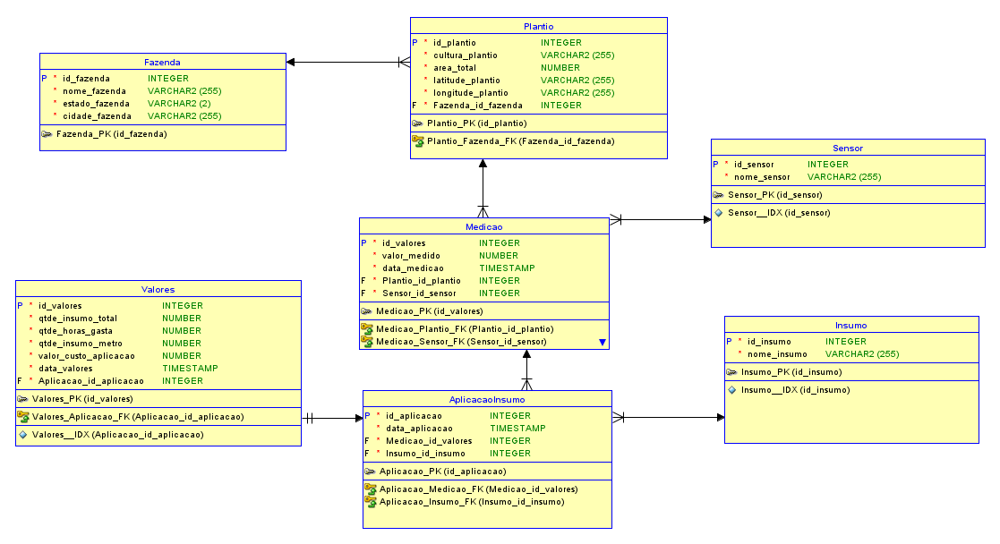

# Projeto de Banco de Dados para Análise de Sensores na Agricultura

## Objetivo
O objetivo deste projeto é criar um sistema de armazenamento (banco de dados) e análise dos dados coletados pelos sensores para ajustar a quantidade de produtos e água aplicados na plantação.

## Informações Relevantes e Dados Necessários

### Exemplo 1: Quantidade Total de Água Aplicada em Cada Mês
- **Dados Necessários:**
  - Data e hora do ajuste de aplicação de água
  - Quantidade de água aplicada

### Exemplo 2: Variação do Nível de pH do Solo ao Longo do Ano
- **Dados Necessários:**
  - Data e hora das leituras dos sensores de pH
  - Valores de pH registrados

## Entidades e Atributos (MER)

### Entidades
1. **AplicacaoInsumo**
   - `id_aplicacao` (INTEGER, PK)
   - `data_aplicacao` (TIMESTAMP)
   - `medicao_id_valores` (INTEGER, FK)
   - `insumo_id_insumo` (INTEGER, FK)

2. **Fazenda**
   - `id_fazenda` (INTEGER, PK)
   - `nome_fazenda` (VARCHAR2(255))
   - `estado_fazenda` (VARCHAR2(2))
   - `cidade_fazenda` (VARCHAR2(255))

3. **Insumo**
   - `id_insumo` (INTEGER, PK)
   - `nome_insumo` (VARCHAR2(255))

4. **Medicao**
   - `id_valores` (INTEGER, PK)
   - `valor_medido` (NUMBER)
   - `data_medicao` (TIMESTAMP)
   - `plantio_id_plantio` (INTEGER, FK)
   - `sensor_id_sensor` (INTEGER, FK)

5. **Plantio**
   - `id_plantio` (INTEGER, PK)
   - `cultura_plantio` (VARCHAR2(255))
   - `area_total` (NUMBER)
   - `latitude_plantio` (VARCHAR2(255))
   - `longitude_plantio` (VARCHAR2(255))
   - `fazenda_id_fazenda` (INTEGER, FK)

6. **Sensor**
   - `id_sensor` (INTEGER, PK)
   - `nome_sensor` (VARCHAR2(255))

7. **Valores**
   - `id_valores` (INTEGER, PK)
   - `qtde_insumo_total` (NUMBER)
   - `qtde_horas_gasta` (NUMBER)
   - `qtde_insumo_metro` (NUMBER)
   - `valor_custo_aplicacao` (NUMBER)
   - `data_valores` (TIMESTAMP)
   - `aplicacao_id_aplicacao` (INTEGER, FK)

## Cardinalidade
- Um **Sensor** pode ter muitas **Medicoes** (1:N)
- Um **Plantio** pode ter muitas **Medicoes** (1:N)
- Uma **Fazenda** pode ter muitos **Plantios** (1:N)
- Uma **AplicacaoInsumo** está associada a um **Insumo** (1:1)
- Uma **AplicacaoInsumo** está associada a uma **Medicao** (1:1)
- Um **Valores** está associado a uma **AplicacaoInsumo** (1:1)

## Relacionamentos (MER)
- **AplicacaoInsumo** (1) --- (1) **Insumo**
- **AplicacaoInsumo** (1) --- (1) **Medicao**
- **Medicao** (N) --- (1) **Plantio**
- **Medicao** (N) --- (1) **Sensor**
- **Plantio** (N) --- (1) **Fazenda**
- **Valores** (1) --- (1) **AplicacaoInsumo**

## Tipos de Dados
- `id_aplicacao`: INTEGER
- `data_aplicacao`: TIMESTAMP
- `medicao_id_valores`: INTEGER
- `insumo_id_insumo`: INTEGER
- `id_fazenda`: INTEGER
- `nome_fazenda`: VARCHAR2(255)
- `estado_fazenda`: VARCHAR2(2)
- `cidade_fazenda`: VARCHAR2(255)
- `id_insumo`: INTEGER
- `nome_insumo`: VARCHAR2(255)
- `id_valores`: INTEGER
- `valor_medido`: NUMBER
- `data_medicao`: TIMESTAMP
- `plantio_id_plantio`: INTEGER
- `sensor_id_sensor`: INTEGER
- `id_plantio`: INTEGER
- `cultura_plantio`: VARCHAR2(255)
- `area_total`: NUMBER
- `latitude_plantio`: VARCHAR2(255)
- `longitude_plantio`: VARCHAR2(255)
- `fazenda_id_fazenda`: INTEGER
- `id_sensor`: INTEGER
- `nome_sensor`: VARCHAR2(255)
- `qtde_insumo_total`: NUMBER
- `qtde_horas_gasta`: NUMBER
- `qtde_insumo_metro`: NUMBER
- `valor_custo_aplicacao`: NUMBER
- `data_valores`: TIMESTAMP
- `aplicacao_id_aplicacao`: INTEGER

## Diagrama Entidade-Relacionamento (DER)
O DER foi criado utilizando o SQLDesigner. Abaixo está a imagem do modelo:



## Como Executar
1. Clone o repositório:
   ```bash
   git clone https://github.com/seu-usuario/seu-repositorio.git
